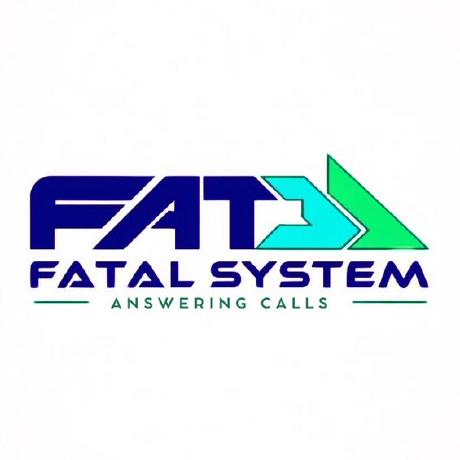

# PSOO-2025
Gerenciamentos de Chamados

Esse trabalho é referente ao Projeto Integrado Multidisciplinar do curso de Análise e Desenvolvimento de Sistemas da  UNIP  São José dos Campos, criado em equipe.

      
      <h2 align="center"> Fatal System</h2>

## Desafio 
O projeto tem como foco o desenvolvimento de um sistema para gerenciamento de chamados, com o apoio de uma Inteligência Artificial (IA) na triagem inicial.

Esse sistema deverá possibilitar que os chamados registrados pelos usuários sejam automaticamente avaliados pela IA, que sugerirá soluções inteligentes à equipe de suporte técnico. A equipe, por sua vez, será responsável por revisar essas sugestões, podendo aprová-las, adaptá-las conforme necessário ou recusá-las.

Todo o processo de tratamento dos chamados será documentado em um repositório central, garantindo não apenas a rastreabilidade das ações, mas também a evolução contínua do sistema por meio do aprendizado com os atendimentos anteriores. Esse histórico ficará disponível para consulta pela equipe técnica, pelo administrador do sistema e pela própria IA, contribuindo com análises e decisões futuras.

A proposta visa principalmente agilizar o atendimento, aliviar a carga de trabalho da equipe de TI e elevar a eficácia na resolução de chamados dentro da organização.

## Backlog do Produto
| Link para o Backlog do produto |
|--------------------------------|
|[Backlog]()

## 📅 Tabela de Sprints
|    Período    | Link para Documentação | Link para Vídeo no YouTube |
| ------------- | ---------------------- | -------------------------- |
| xx/xx - xx/xx | [Sprint 1](#)          | [Vídeo 1](#)               |
| xx/xx - yy/yy | [Sprint 2](#)          | [Vídeo 2](#)               |
| xx/xx - yy/yy | [Sprint 3](#)          | [Vídeo 3](#)               |

</pre>

## Solução Proposta
* Priorização e Categorização de chamados por IA
* Capacidade de IA propor soluções dos chamados para Equipe de TI
* Geração de relatórios mensais, semanais e anuais dos chamados
* Criação de Usuario pelo Admin

## Tecnologias Utilizadas
* 
* 
* 
* 

## DoR - Definition of Ready
* Design no <strong>Figma</strong>
* Diagramas e modelagem do sistema no <strong>Astah</strong>
* Diagrama de estruturação do Banco de Dados no <strong>Br Modelo</strong>
* Modelagem do Banco de Dados no <strong>SQL Server</strong>
 

* ##  Equipe
| Nome                          | Papel         | GitHub                                    | LinkedIn                                                      |
| ----------------------------- | ------------- |------------------------------------------ | ------------------------------------------------------------- |
| Gabriel Chiaramonte Gonçalves     | Desenvolvedor |[GitHub](https://github.com/Chiaramontee) | [LinkedIn](https://www.linkedin.com/in/gabriel-chiaramonte-gonçalves-918141373)

