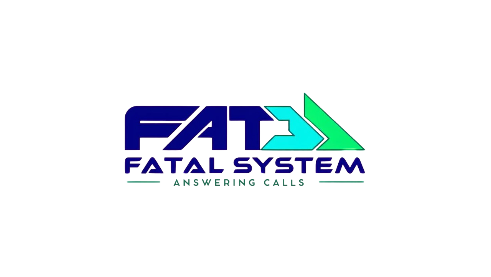

# 🛠️ PSOO-2025
Gerenciamentos de Chamados

Esse trabalho é referente ao Projeto Integrado Multidisciplinar do curso de Análise e Desenvolvimento de Sistemas da  UNIP  São José dos Campos.

      
      <h2 align="center"> Fatal System</h2>

##  🎯 Desafio 
O projeto tem como foco o desenvolvimento de um sistema para gerenciamento de chamados, com o apoio de uma Inteligência Artificial (IA) na triagem inicial.

Esse sistema deverá possibilitar que os chamados registrados pelos usuários sejam automaticamente avaliados pela IA, que sugerirá soluções inteligentes à equipe de suporte técnico. A equipe, por sua vez, será responsável por revisar essas sugestões, podendo aprová-las, adaptá-las conforme necessário ou recusá-las.

Todo o processo de tratamento dos chamados será documentado em um repositório central, garantindo não apenas a rastreabilidade das ações, mas também a evolução contínua do sistema por meio do aprendizado com os atendimentos anteriores. Esse histórico ficará disponível para consulta pela equipe técnica, pelo administrador do sistema e pela própria IA, contribuindo com análises e decisões futuras.

A proposta visa principalmente agilizar o atendimento, aliviar a carga de trabalho da equipe de TI e elevar a eficácia na resolução de chamados dentro da organização.

## 📋 Backlog do Produto
| Link para o Backlog do produto |
|--------------------------------|
|👉[Backlog](https://github.com/Chiaramontee/PSOO-2025/blob/main/Docs/Backlog.md)

## 📋 Tabela descritiva das sprints
| Link para as sprints |
|--------------------------------|
|👉[Sprints](https://github.com/Chiaramontee/PSOO-2025/blob/main/Docs/Sprints.md)

</pre>

## 🖥️ Tecnologias usadas
| Link para as Tecnologias |
|----------------------|
|👉[Tecnologias](https://github.com/Chiaramontee/PSOO-2025/blob/main/Docs/Tecnologias.md)

## 📁Estrutura do projeto 
| Link para as estrutura |
|----------------------|
|👉[Estrutura](https://github.com/Chiaramontee/PSOO-2025/blob/main/Docs/Soluções_Propostas.md)

##  📁Pasta De Documentação
| Link para a Documentação|
|----------------------|
|👉[Documentação](https://github.com/Chiaramontee/PSOO-2025/tree/main/Docs)

## 👥 Equipe
| Link para a Equipe|
|----------------------|
|👉[Equipe](https://github.com/Chiaramontee/PSOO-2025/blob/main/Docs/Equipe.md)

## 👥 DoR - DoD
| Link para O DoR e DoD|
|----------------------|
|👉[DoR - Dod](https://github.com/Chiaramontee/PSOO-2025/blob/main/Docs/dor%20-%20dod.md)

## 📖 Manual de instalação

- Instale o Astah Viewer ( [Download](https://astah.net/products/astah-viewer) ).

- Navegue até a localização do arquivo do diagrama  encontrado na solução 

- Clique no arquivo e, de seguida, clique no botão **"Raw"** ou **"Download"** para guardar o ficheiro no seu computador.

- Abra o **Astah Viewer**.

- No menu, selecione **"File" (Ficheiro)** e, de seguida, **"Open" (Abrir)**.

- Selecione o ficheiro **`.asta`** que descarregou do GitHub.

